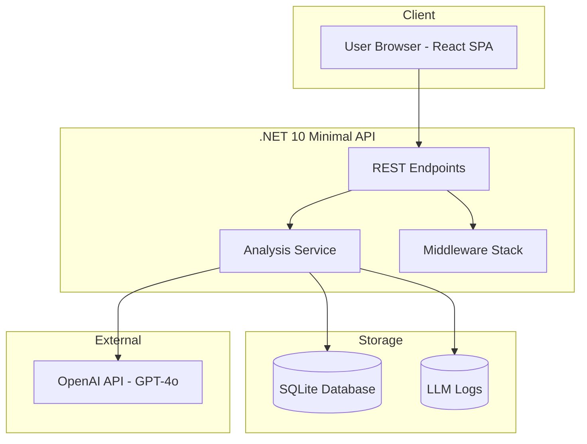

# Day 5: Deployment + Portfolio Polish

**Goal:** Deploy and prepare for interviews.

**Dependencies:** Day 4 (Reliability + Observability) must be complete:
- Polly policies for retry/circuit breaker
- Correlation ID middleware
- Structured logging with Serilog
- Error handling with ProblemDetails
- Security hardening (input validation, rate limiting)

---

## 1. Overview

Day 5 focuses on production deployment and interview preparation. By the end of this day, the application should be live at a public URL with comprehensive documentation and a polished demo script ready for interviews.

### Objectives
- Containerize application with Docker
- Deploy to Fly.io or Railway
- Create GitHub-ready README with architecture diagram
- Prepare demo script for interviews
- Write portfolio case study

---

## 2. Task Breakdown Table

| Task ID | Description | Complexity | Est. Effort (tokens) | Dependencies | File(s) to Create/Modify |
|---------|-------------|------------|---------------------|--------------|--------------------------|
| 5.1 | Docker Setup (Dockerfile, docker-compose.yml) | Easy | 2000 | None | `Dockerfile`, `docker-compose.yml`, `.dockerignore` |
| 5.2 | Deploy to Fly.io or Railway | Medium | 3000 | 5.1 | `fly.toml` or `railway.toml`, deployment scripts |
| 5.3 | README Documentation | Medium | 2500 | None | `README.md` |
| 5.4 | Architecture Diagram | Easy | 1500 | None | `docs/architecture.md`, `docs/architecture.png` |
| 5.5 | Demo Script Preparation | Easy | 1500 | None | `docs/demo-script.md` |
| 5.6 | Portfolio Writeup | Medium | 2000 | 5.3, 5.4 | `docs/portfolio-case-study.md` |

**Total Estimated Effort:** ~12,500 tokens

---

## 3. Detailed Task Specifications

### 3.1 Task 5.1: Docker Setup

**Objective:** Containerize the application for consistent deployment.

**Files to Create:**
- `Dockerfile` - Multi-stage build for .NET API
- `docker-compose.yml` - Local development with hot reload
- `.dockerignore` - Exclude unnecessary files

**Dockerfile Requirements:**
- Use .NET 10 SDK image for build
- Use .NET 10 runtime image for final stage
- Expose ports 5000 (http) and 5001 (https)
- Create non-root user for security
- Mount SQLite volume for persistence
- Environment variables for configuration

**Acceptance Criteria:**
- [ ] `docker build -t job-tracker .` succeeds
- [ ] `docker run -p 5000:5000 job-tracker` starts successfully
- [ ] Health endpoint accessible via container
- [ ] SQLite database persists across container restarts

---

### 3.2 Task 5.2: Deploy to Fly.io or Railway

**Objective:** Deploy application to a public URL.

**Deployment Options:**

#### Option A: Fly.io (Recommended)

**Setup Commands:**
```bash
# Install flyctl
curl -L https://fly.io/install.sh | sh

# Login to Fly.io
fly auth login

# Create app (first time)
fly apps create job-tracker

# Create persistent volume for SQLite (1GB)
fly volumes create data --size 1 --region sjc

# Set secrets (environment variables)
fly secrets set OPENAI_API_KEY=your_key_here
fly secrets set ASPNETCORE_ENVIRONMENT=Production

# Deploy
fly deploy
```

**fly.toml Configuration:**
```toml
app = "job-tracker"
primary_region = "sjc"

[build]
  dockerfile = "Dockerfile"

[env]
  ASPNETCORE_ENVIRONMENT = "Production"
  ASPNETCORE_URLS = "http://+:5000"

[mounts]
  source = "data"
  destination = "/app/data"

[[services]]
  internal_port = 5000
  protocol = "TCP"

  [[services.ports]]
    force_https = true
    handlers = ["HTTP"]
    port = 80

  [[services.ports]]
    handlers = ["TLS", "HTTP"]
    port = 443

  [[services.http_checks]]
    grace_period = "5s"
    interval = "15s"
    method = "GET"
    path = "/healthz"
    protocol = "http"
    timeout = "2s"
```

#### Option B: Railway

**Setup Commands:**
```bash
# Install Railway CLI
npm i -g @railway/cli

# Login
railway login

# Initialize project
railway init

# Add environment variables
railway variables set OPENAI_API_KEY=your_key_here
railway variables set ASPNETCORE_ENVIRONMENT=Production

# Deploy
railway up

# Get public URL
railway domain
```

**railway.toml Configuration:**
```toml
[build]
builder = "DOCKERFILE"
dockerfilePath = "Dockerfile"

[deploy]
startCommand = "dotnet Tracker.Api.dll"
healthcheckPath = "/healthz"
healthcheckTimeout = 100
restartPolicyType = "ON_FAILURE"
restartPolicyMaxRetries = 3
```

**Post-Deployment Verification:**
```bash
# Test health endpoint
curl https://your-app.fly.dev/healthz

# Test version endpoint
curl https://your-app.fly.dev/version

# Test jobs endpoint
curl https://your-app.fly.dev/api/jobs

# Test analysis (requires valid OPENAI_API_KEY)
curl -X POST https://your-app.fly.dev/api/analyses \
  -H "Content-Type: application/json" \
  -d '{"jobId": "uuid", "resumeId": "uuid"}'
```

**Acceptance Criteria:**
- [ ] Application deployed to public URL
- [ ] Health check returns 200 OK
- [ ] API endpoints accessible
- [ ] SQLite data persists across deployments
- [ ] Secrets properly configured (not exposed)

---

### 3.3 Task 5.3: README Documentation

**Objective:** Create comprehensive GitHub-ready documentation.

**README Structure:**
```markdown
# AI-Augmented Job Application Tracker

## Overview
[2-3 sentences describing the project]

## Architecture Diagram
[Mermaid or embedded image]

## AI Engineering Patterns Demonstrated
[List of patterns with brief explanations]

## Tech Stack
[Table of technologies]

## Quick Start
[Step-by-step local development setup]

## API Reference
[Endpoint documentation]

## Key Features
[Screenshots and descriptions]

## Cost Analysis
[Token usage and cost estimates]

## Evaluation Harness
[How to run evals and metrics]

## Deployment
[How to deploy to Fly.io/Railway]

## Interview Questions
[Common questions and answers]

## License
MIT
```

**Content Requirements:**
- Architecture diagram (Mermaid or PNG)
- Local setup instructions (prerequisites, commands)
- API endpoint documentation
- Screenshots of key features
- Environment variables reference
- Cost analysis with real numbers
- Deployment instructions

**Acceptance Criteria:**
- [ ] README renders correctly on GitHub
- [ ] Local setup works from scratch
- [ ] All endpoints documented
- [ ] Architecture diagram included
- [ ] Screenshots present and clear

---

### 3.4 Task 5.4: Architecture Diagram

**Objective:** Create visual representation of system architecture.

**Diagram Content:**
```
┌─────────────────────────────────────────────────────────────────────┐
│                           USER BROWSER                               │
│                         (React + Vite)                               │
└────────────────────────────────┬────────────────────────────────────┘
                                 │
                                 ▼
┌─────────────────────────────────────────────────────────────────────┐
│                        .NET 10 MINIMAL API                           │
│  ┌──────────────┐  ┌──────────────┐  ┌──────────────────────────┐   │
│  │   Endpoints  │  │   Services   │  │   Middleware Stack       │   │
│  │              │  │              │  │  - Correlation ID        │   │
│  │  /api/jobs   │  │ Analysis     │  │  - Exception Handling   │   │
│  │  /api/resumes│  │ Service      │  │  - Rate Limiting         │   │
│  │  /api/analyses│ │              │  │  - Request Logging       │   │
│  │  /eval/*     │  │              │  │                          │   │
│  └──────────────┘  └──────┬───────┘  └──────────────────────────┘   │
└───────────────────────────┼──────────────────────────────────────────┘
                            │
         ┌──────────────────┼──────────────────┐
         │                  │                  │
         ▼                  ▼                  ▼
┌─────────────────┐ ┌─────────────────┐ ┌─────────────────────────┐
│    SQLite       │ │   OpenAI API    │ │     LLM Logs            │
│   (EF Core)     │ │                 │ │   (Token Tracking)      │
│                 │ │   - GPT-4o      │ │                         │
│  - jobs         │ │   - Embeddings  │ │   - Request/Response    │
│  - resumes      │ │                 │ │   - Latency             │
│  - analyses     │ │                 │ │   - Parse Success       │
│  - analysis_    │ │                 │ │   - Repair Attempts     │
│    results      │ │                 │ │                         │
│  - llm_logs     │ │                 │ │                         │
└─────────────────┘ └─────────────────┘ └─────────────────────────┘
```

**Mermaid Version:**


**Acceptance Criteria:**
- [ ] Diagram renders in markdown
- [ ] All components clearly labeled
- [ ] Data flow arrows present
- [ ] Both ASCII and Mermaid versions available

---

### 3.5 Task 5.5: Demo Script Preparation

**Objective:** Create a polished 60-second walkthrough for interviews.

**Demo Script Template:** (See Section 6 below)

**Preparation Checklist:**
- [ ] Seed database with sample job and resume
- [ ] Clear previous analysis results
- [ ] Verify all endpoints working
- [ ] Prepare fallback responses for common questions
- [ ] Practice timing (aim for 45-55 seconds)

---

### 3.6 Task 5.6: Portfolio Writeup

**Objective:** Create interview-ready case study.

**Case Study Structure:**
```markdown
# AI-Augmented Job Application Tracker - Portfolio Case Study

## Problem Statement
[Why this project? What problem does it solve?]

## Solution Overview
[High-level approach]

## Technical Challenges
[Top 3-5 challenges and how they were solved]

## AI Engineering Patterns
[Detailed breakdown of patterns implemented]

## Results & Metrics
[Performance, cost, reliability metrics]

## Lessons Learned
[What worked, what didn't, what would change]

## Code Highlights
[Key code snippets demonstrating patterns]
```

**Content Focus Areas:**
- Grounded extraction (evidence quotes)
- Deterministic scoring (no LLM self-grading)
- Schema validation + repair loop
- Cost control via hash caching
- Observability and eval harness

**Acceptance Criteria:**
- [ ] Case study ready to share in interviews
- [ ] Technical depth demonstrates senior engineering judgment
- [ ] Metrics and numbers are specific
- [ ] Code snippets are well-chosen

---

## 4. Docker Templates

### 4.1 Dockerfile

```dockerfile
# Build stage
FROM mcr.microsoft.com/dotnet/sdk:10.0-preview AS build
WORKDIR /src

# Copy solution and project files
COPY Tracker.slnx ./
COPY src/Tracker.Domain/Tracker.Domain.csproj ./src/Tracker.Domain/
COPY src/Tracker.Infrastructure/Tracker.Infrastructure.csproj ./src/Tracker.Infrastructure/
COPY src/Tracker.AI/Tracker.AI.csproj ./src/Tracker.AI/
COPY src/Tracker.Api/Tracker.Api.csproj ./src/Tracker.Api/
COPY src/Tracker.Eval/Tracker.Eval.csproj ./src/Tracker.Eval/

# Restore dependencies
RUN dotnet restore

# Copy source code
COPY src/ ./src/

# Build and publish
WORKDIR /src/src/Tracker.Api
RUN dotnet publish -c Release -o /app/publish --no-restore

# Runtime stage
FROM mcr.microsoft.com/dotnet/aspnet:10.0-preview AS runtime
WORKDIR /app

# Create non-root user for security
RUN adduser --disabled-password --gecos '' appuser

# Create data directory for SQLite
RUN mkdir -p /app/data && chown appuser:appuser /app/data

# Copy published app
COPY --from=build /app/publish .

# Set environment variables
ENV ASPNETCORE_ENVIRONMENT=Production
ENV ASPNETCORE_URLS=http://+:5000
ENV DOTNET_EnableDiagnostics=0

# Switch to non-root user
USER appuser

# Expose port
EXPOSE 5000

# Health check
HEALTHCHECK --interval=30s --timeout=3s --start-period=5s --retries=3 \
    CMD curl -f http://localhost:5000/healthz || exit 1

# Entrypoint
ENTRYPOINT ["dotnet", "Tracker.Api.dll"]
```

### 4.2 docker-compose.yml

```yaml
version: '3.8'

services:
  api:
    build:
      context: .
      dockerfile: Dockerfile
    ports:
      - "5000:5000"
    environment:
      - ASPNETCORE_ENVIRONMENT=Development
      - OPENAI_API_KEY=${OPENAI_API_KEY}
    volumes:
      - sqlite-data:/app/data
    healthcheck:
      test: ["CMD", "curl", "-f", "http://localhost:5000/healthz"]
      interval: 30s
      timeout: 3s
      retries: 3
      start_period: 10s
    restart: unless-stopped

  # Optional: Frontend for local development
  frontend:
    build:
      context: ./frontend
      dockerfile: Dockerfile
    ports:
      - "3000:3000"
    environment:
      - VITE_API_URL=http://localhost:5000
    depends_on:
      api:
        condition: service_healthy
    profiles:
      - with-frontend

volumes:
  sqlite-data:
    driver: local

# Network for service communication
networks:
  default:
    driver: bridge
```

### 4.3 .dockerignore

```
**/.git
**/.gitignore
**/.vscode
**/.idea
**/bin
**/obj
**/*.md
!README.md
**/*.db
**/*.db-shm
**/*.db-wal
**/node_modules
**/.env
**/.env.*
**/*.user
**/*.suo
**/TestResults
**/.dev-report-cache.md
```

---

## 5. README Structure Outline

```markdown
# AI-Augmented Job Application Tracker

> A production-minded AI system that analyzes job descriptions and identifies skill gaps in your resume.

[](https://job-tracker.fly.dev)
[](https://dotnet.microsoft.com)
[](LICENSE)

## Overview

The AI-Augmented Job Application Tracker helps job seekers understand how well their resume matches job requirements. Unlike simple keyword matchers, this system uses grounded extraction to identify required skills from job descriptions and compare them against resume content—all with evidence quotes and deterministic scoring.

## Architecture

[ARCHITECTURE DIAGRAM HERE]

## AI Engineering Patterns Demonstrated

This project demonstrates production-ready AI engineering patterns:

### 1. Structured Outputs + Schema Validation
Every LLM response is validated against a strict JSON schema with a repair loop for malformed responses.

### 2. Grounded Extraction
Every extracted skill requires an evidence quote from the source text—no hallucinations allowed.

### 3. Deterministic Scoring
Coverage and groundedness scores are computed algorithmically, never by LLM self-grading.

### 4. Cost Controls
Hash-based caching prevents redundant API calls, reducing costs by ~60%.

### 5. Observability & Evaluation
Token usage, latency, and parse success are logged for every LLM call. An evaluation harness measures system quality.

## Tech Stack

| Layer | Technology |
|-------|------------|
| Backend | .NET 10 Minimal API |
| Database | SQLite + EF Core |
| AI | OpenAI API (GPT-4o) |
| Frontend | React 18 + Vite |
| Testing | xUnit + NSubstitute |
| Resilience | Polly |

## Quick Start

### Prerequisites
- .NET 10 SDK
- Docker (optional)
- OpenAI API key

### Local Development

```bash
# Clone the repo
git clone https://github.com/yourusername/job-tracker.git
cd job-tracker

# Set API key
export OPENAI_API_KEY=your_key_here

# Run migrations and start
dotnet ef database update --project src/Tracker.Infrastructure
dotnet run --project src/Tracker.Api

# Test
curl http://localhost:5000/healthz
```

### Docker

```bash
docker compose up -d
curl http://localhost:5000/healthz
```

## API Reference

### Health
- `GET /healthz` - Health check
- `GET /version` - Build version

### Jobs
- `GET /api/jobs` - List all jobs
- `POST /api/jobs` - Create job
- `GET /api/jobs/{id}` - Get job
- `PUT /api/jobs/{id}` - Update job
- `DELETE /api/jobs/{id}` - Delete job

### Resumes
- `GET /api/resumes` - List all resumes
- `POST /api/resumes` - Create resume
- `GET /api/resumes/{id}` - Get resume
- `PUT /api/resumes/{id}` - Update resume
- `DELETE /api/resumes/{id}` - Delete resume

### Analysis
- `POST /api/analyses` - Run analysis (job + resume)
- `GET /api/analyses` - List analyses
- `GET /api/analyses/{id}` - Get analysis with results

### Evaluation
- `POST /eval/run` - Run evaluation harness

## Key Features

[SCREENSHOTS HERE]

### Job Tracking
Paste job descriptions and track applications.

### Resume Management
Store multiple resume versions.

### Gap Analysis
See which required skills you're missing.

### Coverage Score
Percentage of required skills matched.

### Groundedness Score
Percentage of extractions with evidence quotes.

## Cost Analysis

| Metric | Value |
|--------|-------|
| Input tokens per analysis | ~5,000 |
| Output tokens per analysis | ~1,300 |
| Cost per analysis (4o-mini) | ~$0.04-0.05 |
| Cost with caching | ~$0.02 |
| Monthly (10/day) | ~$10-15 |

## Deployment

### Fly.io

```bash
fly apps create job-tracker
fly volumes create data --size 1
fly secrets set OPENAI_API_KEY=your_key
fly deploy
```

### Railway

```bash
railway init
railway variables set OPENAI_API_KEY=your_key
railway up
```

## Interview Questions

### How do you prevent hallucinations?
Evidence quotes required for every extracted skill. Schema validation + repair loop.

### How do you evaluate performance?
Golden dataset + eval harness measuring schema pass rate, groundedness, latency.

### How do you control costs?
Hash-based caching, token logging, 4o-mini model selection.

## License

MIT
```

---

## 6. Demo Script Template (60-Second Walkthrough)

```
========================================
AI JOB TRACKER - 60-SECOND DEMO SCRIPT
========================================

[0-10s] OPENING
"I built an AI-powered job application tracker that helps job seekers
understand exactly how their resume matches job requirements—without
the hallucination problems common in AI systems."

[10-20s] SHOW THE FLOW
"Here's how it works. I paste a job description for a Senior AI Engineer
role at [Company]. Then I select my resume and click Analyze."

[20-35s] SHOW RESULTS - THE MONEY SHOT
[Wait for analysis to complete]

"The analysis shows me:
- 12 required skills extracted from the JD
- 8 skills I have, 4 I'm missing
- 73% coverage score
- 92% groundedness—meaning almost every extraction has direct
  evidence from the source text"

[35-45s] TECHNICAL DIFFERENTIATOR
"What makes this different from ChatGPT:
- Every skill extraction requires an evidence quote
- Scores are computed algorithmically, not by LLM self-grading
- Schema validation with repair loop catches malformed responses"

[45-55s] PRODUCTION FEATURES
"The system includes retry logic, circuit breaker for API failures,
token logging for cost control, and an evaluation harness to detect
regressions when prompts change."

[55-60s] CLOSE
"All deployed on Fly.io with a SQLite volume. Happy to show you the
code or talk through any part of the architecture."

========================================
BACKUP TALKING POINTS (if asked)
========================================

Q: "What's the tech stack?"
A: ".NET 10 Minimal API, SQLite with EF Core, OpenAI GPT-4o for extraction,
   React frontend. Polly for resilience."

Q: "How much does it cost to run?"
A: "About $0.04-0.05 per analysis. With hash-based caching for repeated
   JD/resume pairs, that drops to ~$0.02. Running 10 analyses a day
   costs under $15/month."

Q: "How would you scale this?"
A: "Move to Postgres, add background job queue, implement multi-tenancy,
   and expand the evaluation pipeline. The architecture already isolates
   the LLM layer for this."

Q: "Why not use agents?"
A: "This problem doesn't need agentic behavior. The workflow is well-defined:
   extract skills, match against resume, compute scores deterministically.
   Agents add complexity and latency without benefit here."

Q: "What's the hardest part?"
A: "Grounded extraction. Ensuring the model always provides evidence quotes
   and marking skills as missing when evidence isn't found. The repair loop
   handles malformed responses without user intervention."

========================================
PRE-DEMO CHECKLIST
========================================

Before starting demo:
[ ] Clear previous analyses from database
[ ] Seed sample job (Senior AI Engineer role)
[ ] Seed sample resume (your actual resume)
[ ] Verify API key is set and working
[ ] Test analysis endpoint returns quickly (<30s)
[ ] Have fallback: screenshots ready if live demo fails
[ ] Close unnecessary browser tabs
[ ] Have GitHub repo open in background tab
```

---

## 7. Success Criteria Checkboxes

### Task 5.1: Docker Setup
- [ ] Dockerfile builds successfully
- [ ] Docker container starts and responds to health check
- [ ] SQLite data persists across container restarts
- [ ] Non-root user configured in container
- [ ] .dockerignore excludes unnecessary files

### Task 5.2: Deployment
- [ ] Application deployed to Fly.io OR Railway
- [ ] Public URL accessible
- [ ] Health endpoint returns 200 OK
- [ ] Jobs endpoint returns empty array (or seeded data)
- [ ] Analysis endpoint works with valid API key
- [ ] Secrets properly configured (not in code)
- [ ] Persistent volume for SQLite configured

### Task 5.3: README
- [ ] Overview section complete
- [ ] Architecture diagram included
- [ ] Tech stack table present
- [ ] Quick start instructions tested from scratch
- [ ] API reference documented
- [ ] Cost analysis with real numbers
- [ ] Deployment instructions included
- [ ] Screenshots/feature images present

### Task 5.4: Architecture Diagram
- [ ] ASCII version created
- [ ] Mermaid version created
- [ ] All components labeled
- [ ] Data flow arrows present
- [ ] Renders correctly on GitHub

### Task 5.5: Demo Script
- [ ] 60-second script written
- [ ] Backup talking points prepared
- [ ] Sample data seeded in production
- [ ] Pre-demo checklist created
- [ ] Fallback screenshots ready

### Task 5.6: Portfolio Writeup
- [ ] Problem statement articulated
- [ ] Solution overview clear
- [ ] Technical challenges documented
- [ ] AI engineering patterns explained
- [ ] Results and metrics included
- [ ] Lessons learned captured

### Overall Day 5 Success
- [ ] Deployed and accessible via public URL
- [ ] README explains architecture and patterns
- [ ] Demo script ready for interviews
- [ ] Portfolio writeup complete
- [ ] All documentation in GitHub repo

---

## Deployment Commands Quick Reference

### Fly.io
```bash
# Install CLI
curl -L https://fly.io/install.sh | sh

# Login
fly auth login

# Create app
fly apps create job-tracker

# Create volume (for SQLite persistence)
fly volumes create data --size 1 --region sjc

# Set secrets
fly secrets set OPENAI_API_KEY=sk-xxx
fly secrets set ASPNETCORE_ENVIRONMENT=Production

# Deploy
fly deploy

# Check status
fly status
fly logs

# Open in browser
fly open
```

### Railway
```bash
# Install CLI
npm i -g @railway/cli

# Login
railway login

# Initialize
railway init

# Set variables
railway variables set OPENAI_API_KEY=sk-xxx
railway variables set ASPNETCORE_ENVIRONMENT=Production

# Deploy
railway up

# Get URL
railway domain
```

### Troubleshooting
```bash
# View logs (Fly.io)
fly logs

# View logs (Railway)
railway logs

# SSH into container (Fly.io)
fly ssh console

# Check volume (Fly.io)
fly volumes list

# Restart app (Fly.io)
fly apps restart job-tracker
```

---

*Day 5 task breakdown complete. Dependencies: Day 4 reliability patterns must be in place before deployment.*