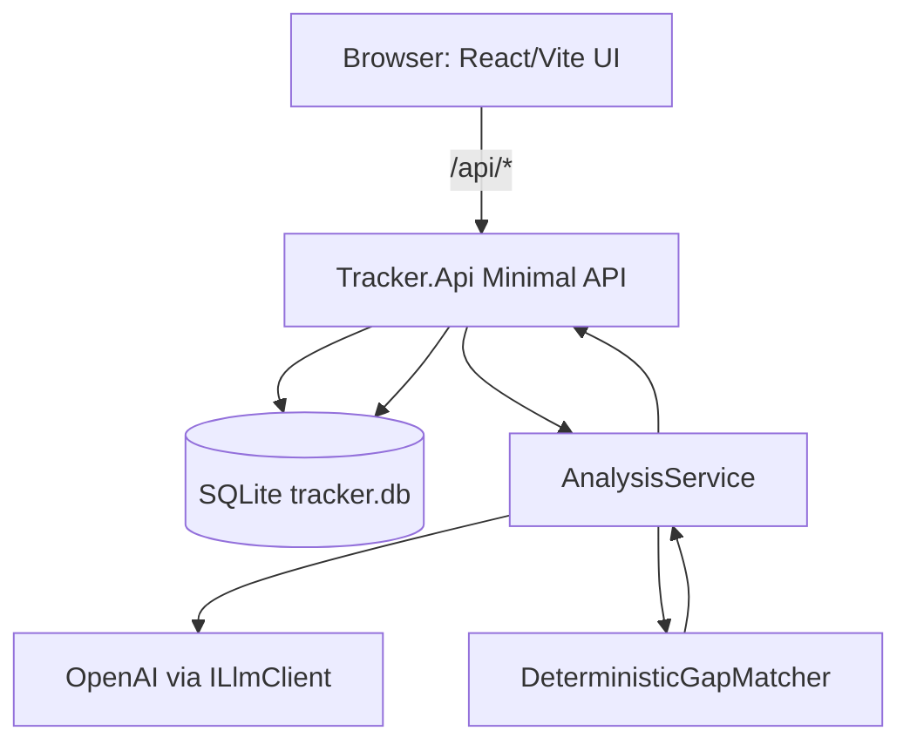

# Architecture

This document reflects the current implementation in `/src` and `/web`.

## System Diagram (ASCII)

```text
┌──────────────────────────────┐
│ Browser (React + Vite dev UI)│
│ web/src/App.tsx              │
└──────────────┬───────────────┘
               │ /api/* (proxy in dev)
               ▼
┌────────────────────────────────────────────┐
│ Tracker.Api (ASP.NET Core Minimal API)    │
│ - Jobs/Resumes/Analyses endpoints         │
│ - InputValidationMiddleware               │
│ - Rate limiting on POST /api/analyses     │
└──────────────┬─────────────────────────────┘
               │ EF Core
               ▼
┌──────────────────────────────┐
│ SQLite (tracker.db)          │
│ jobs / resumes / analyses    │
│ analysis_results / llm_logs  │
└──────────────────────────────┘
               ▲
               │ ILlmClient
┌──────────────┴─────────────────────────────┐
│ Tracker.AI                                 │
│ - JD extraction (LLM)                      │
│ - Deterministic gap matcher                │
│ - LLM fallback when deterministic confidence│
│   is low                                   │
└────────────────────────────────────────────┘
```

## System Diagram (Mermaid)



## Runtime Flow (`POST /api/analyses`)

1. Validate input, enforce length limits, and apply strict rate limit policy.
2. Load `Job` and `Resume` from SQLite.
3. Normalize/hash text and try hash-pair cache reuse from prior completed analyses.
4. Run `AnalysisService`:
   - JD extraction with LLM
   - deterministic gap matching
   - optional LLM fallback only when deterministic confidence is low
5. Persist `Analysis`, `AnalysisResult`, and `LlmLog` rows.
6. Return coverage, groundedness, mode metadata, and usage/latency fields.

## Deployment Guidance (Current State)

### What Exists Today

- `Dockerfile.api`: multi-stage .NET API image, exposes `8080`.
- `Dockerfile.web`: Node + `npm run dev` container for the frontend.
- `docker-compose.yml`: runs API + web + SQLite volume (`sqlite_data`).

Run locally:

```bash
docker compose up --build
```

API: `http://localhost:5278`  
Web: `http://localhost:5173`

### Production Notes

- API container is production-oriented enough to deploy now.
- `Dockerfile.web` currently runs Vite dev server; treat it as a dev convenience, not hardened production hosting.
- SQLite persistence in containers requires mounting `/app/data` and setting:
  - `ConnectionStrings__DefaultConnection=Data Source=/app/data/tracker.db`

### Platform Options

- API-only deploy (Fly.io/Railway/Render) is straightforward using `Dockerfile.api`.
- Keep web static hosting separate or add a production frontend build/serve path later.
- Required secret for real analyses: `OPENAI_API_KEY`.

---

*Documentation maintained by: codex gpt-5*
